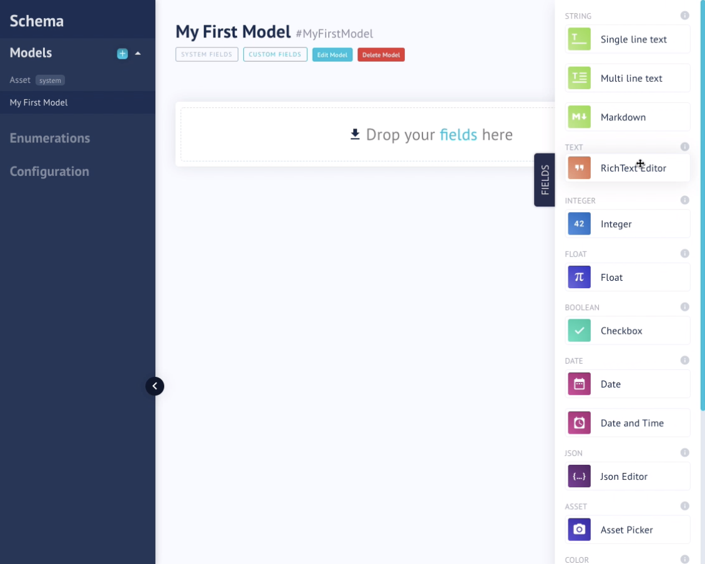
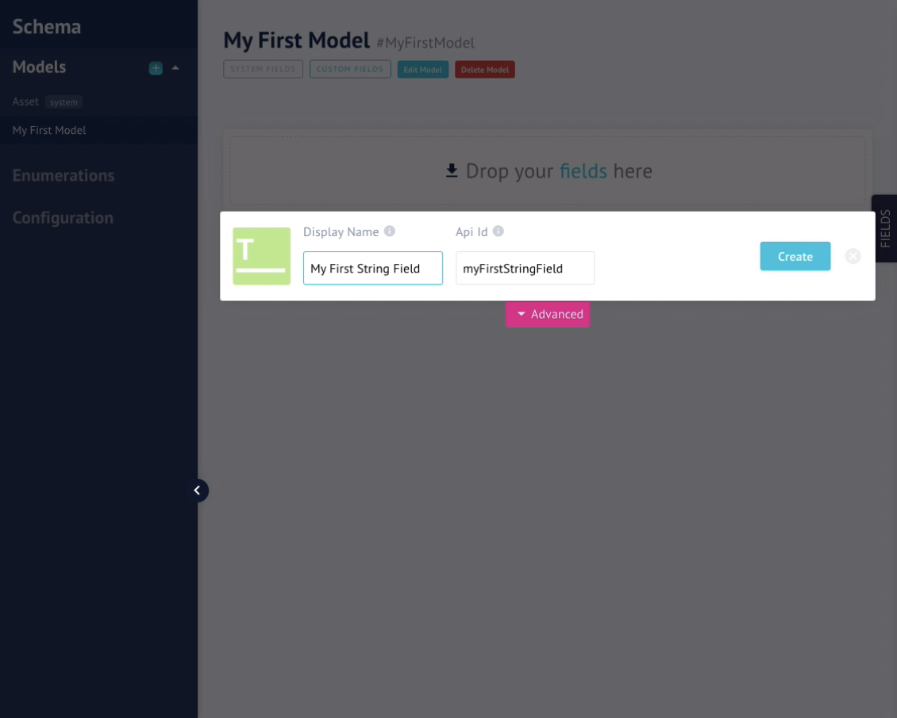

# GraphCMS Tutorial
This is a tutorial to help young get up to speed with GraphCMS. It includes some tips that might be useful.

## Where To Start
### GraphQL
If you don't know GraphQL it's important to have a minimum understanding of the query language. Here are some places you can discover a little bit more about:
- https://graphql.org/ (official page)
- https://www.howtographql.com/ (a website with a hands-on tutorial, for front-end and back-end)
- https://blog.apollographql.com/graphql-vs-rest-5d425123e34b (Apollo it's a very famous platform to help developers adopt GraphQL and in this blog post they explain the difference between REST API and GraphQL)

## GraphCMS
If you have never used the platform, I would recommend that you follow the tutorial of GraphCMS

#### Create a Schema
 Drag and drop the fields that you want.

 [Documentation](https://graphcms.com/docs/graphcms-concepts/schemas)


### Fields
Choose the field type that you want and name it.





<b>IMPORTANT</b>: If you want to add an array type, you can select <i>Allow multiple values</i> in the <i>Advanced</i> tab for different field types.

#### [Type of fields](https://graphcms.com/docs/graphcms-concepts/fields/)
- <b>Single Line Text</b>: names, titles, slugs, list of names.
- <b>Multi Line Text</b>: comments, formatted text.
- <b>Markdown</b>: long-form content, formatted text.
- <b>RichText Editor</b>: long-form content, common formatting options.
- <b>Integer</b>: ID, product number, quantity.
- <b>Float</b>: precise numbers, prices, percentages.
- <b>Checkbox</b>: true or false, yes or no.
- <b>Date</b>: post date, date of birth.
- <b>Date and Time</b>: events, opening hours.
- <b>Json Editor</b>: data in JSON format.
- <b>Asset Picker</b>: any asset, e.g. image, video.
- <b>Color</b>: hex and rgba to define colors in the frontend.
- <b>Map</b>: longitude, latitude of an address or location.
- <b>Dropdown</b>: selection on a predefined set of values (Enumerations).
- <b>Reference</b>: for referencing other schema models. i.e. the author of a blog post.

### Adding data
You can add data on the Content View or in the Asset View. Both of these have a button on the right top that says Create ... (the name of your schema)


## API
To call the API with your url with axios, you can do this:
```
axios('https://api-uswest.graphcms.com/v1/yourID/master', {
  method: 'POST',
  headers: {
    'Content-Type': 'application/json',
    Accept: 'application/json',
  },
  data: {
    query: `{ 
      projects {
        title
        description
        subtitle 
      }
     }`
  },
}).then(res => console.log("Response of API: ", res))
  .catch(err => console.log("Error of API: ", err));
  ```

  On the API Explorer you can try the queries, mutations, and subscription to test it before you call it on your project. Some examples of queries, mutations, and subscriptions:

[Queries](https://graphcms.com/docs/api/content-api#queries)
```
query {
  post(where: { id: "cixnen2vv33lo0143bdwvr52n" }) {
    title
    slug
  }
}
```

[Mutations](https://graphcms.com/docs/api/content-api#mutations)
```
mutation {
    upsertHotel(
        where: HotelWhereUniqueInput!
        create: HotelCreateInput!
        update: HotelUpdateInput!
    ): Hotel!
}
```

All of these cases should be sent on the data field on <i>axios</i>.
